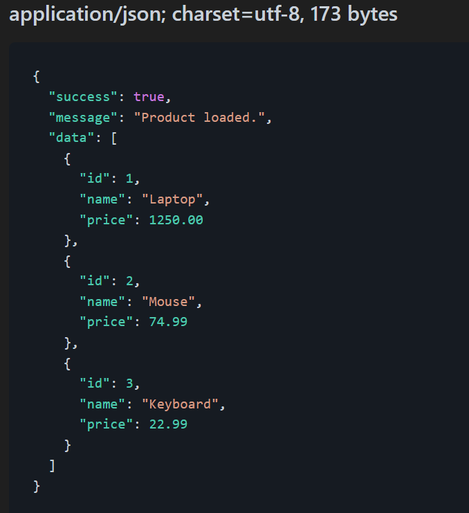
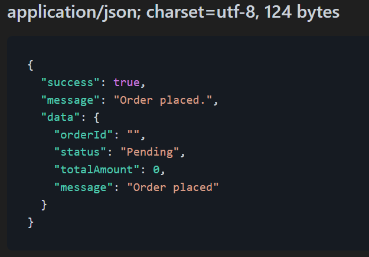
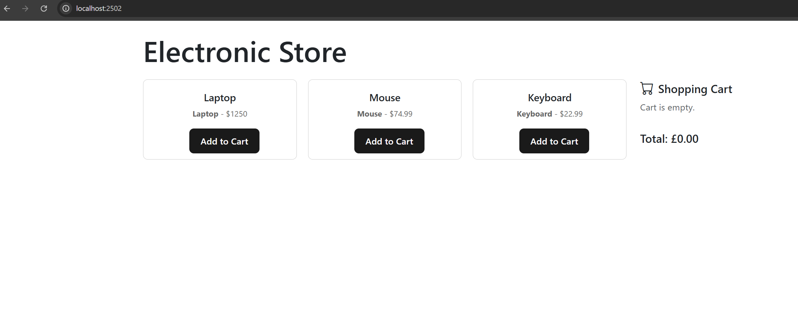
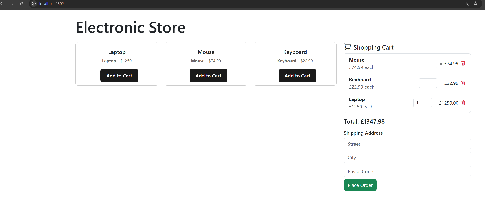

# Designer  (Shopping Cart)

.Net core 9 application with React TSX front end, using microservice clean architecture.
RabbitMq and MassTransit with EF.

## Folder Structure
```
Shopping.sln 
.gitignore  
azure-pipeline.yml
launchSettings 
|-- Api/             # ASP.NET Core Web API project
|-- Test/            # Unit and Integration tests
|-- UX/              # Frontend application (React TSX.)
```

---

## Base URL
```
@Api_HostAddress = http://localhost:5178/api

GET {{Api_HostAddress}}/product/
Accept: application/json

###
POST {{Api_HostAddress}}/order/create
Accept: application/json
Content-Type: application/json

{
    "customerId":123,
    "items":[
        {"id":3,
        "name":"Keyboard",
        "price":22.99,
        "quantity":1
        }],
    "totalAmount":22.99,
    "shippingAddress":{
        "street":"212",
        "city":"Leeds",
        "postalCode":"LS16 7AZ"
        }
}

---

 





 
## For HTTP File Execution
More about HTTP files: [https://aka.ms/vs/httpfile](https://aka.ms/vs/httpfile)

---

## License
This project is licensed under the MIT License.
